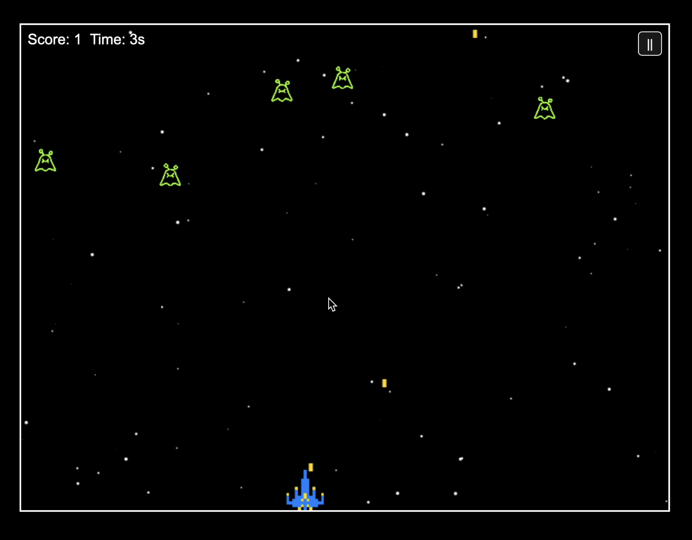

# Space Shooter Game

## Overview

The **Space Shooter Game** is a web-based shooter game designed to demonstrate advanced JavaScript programming, HTML5 Canvas, and CSS styling techniques. This project highlights the implementation of game logic, collision detection, and responsive design principles.

[Live Demo](https://sankeerthini.github.io/Space-Shooter/)

## Features

- **Responsive Design**: Ensures compatibility across various devices and screen sizes.
- **Dynamic Background**: Utilizes HTML5 Canvas for rendering.
- **Real-time Player Interaction**: Smooth player controls for a seamless gaming experience.
- **Background Music**: Enhances the immersive experience.

## Technologies Used

- **HTML5**: Structure of the game.
- **CSS3**: Styling and responsive design.
- **JavaScript (ES6)**: Game logic and interactions.
- **Canvas API**: Rendering the game graphics.
- **Font Awesome**: Icons for social media links.

## Technical Highlights

### JavaScript

- **Game Loop**: Implemented using `requestAnimationFrame` for smooth rendering and game state updates.
- **Collision Detection**: Efficient algorithms for detecting and handling collisions between bullets and enemies.
- **Object-Oriented Programming**: Utilizes classes for defining game objects like `Player`, `Enemy`, and `Bullet`.

### HTML5 Canvas

- **Rendering**: Custom drawing of game elements (player, enemies, bullets) and dynamic backgrounds.
- **Animation**: Smooth animations achieved through optimized rendering techniques.

### CSS3

- **Responsive Design**: Ensures the game is playable on different screen sizes, from desktops to mobile devices.
- **Styling**: Modern CSS techniques for layout and design consistency.

## Project Structure

- **index.html**: The main HTML file that includes the structure of the game.
- **styles.css**: The CSS file for styling the game interface.
- **script.js**: The JavaScript file containing the game logic and interactions.

## Author

**Sankeerthini Dhandapani**

- [GitHub](https://github.com/sankeerthini)
- [LinkedIn](https://www.linkedin.com/in/sankeerthini-d)
